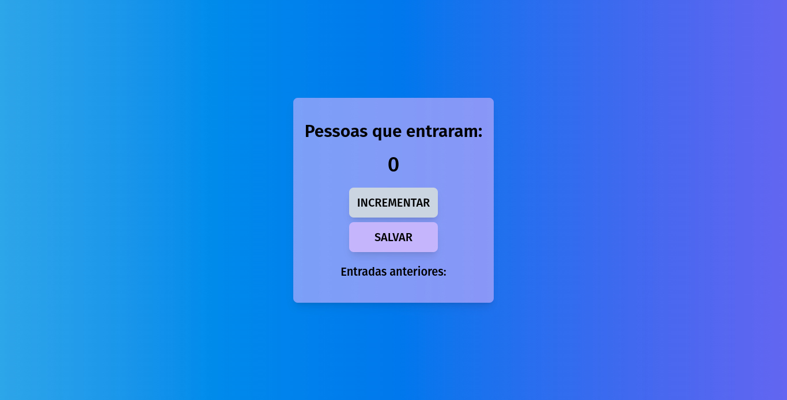

# Scrimba's JavaScript course projects

## #1 - Passenger Counter

This little project it's a passenger counter, which counts how many people have entered the train, bus etc. It has an **increment** button to count and a **save** button to save the previous entries.

[🔗 Go to site](https://passengercounter-scrimba.netlify.app/)
