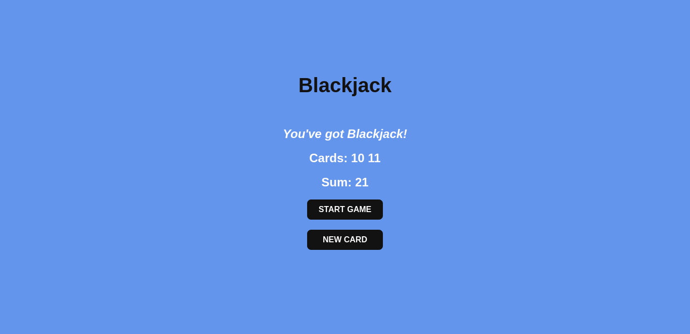
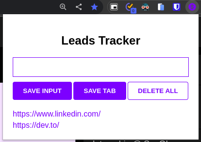

# Scrimba's JavaScript course projects

## #1 - Passenger Counter

This little project it's a passenger counter, which counts how many people have entered the train, bus etc. It has an **increment** button to count and a **save** button to save the previous entries.

[🔗 Go to site](https://passengercounter-scrimba.netlify.app/)

## #2 - Blackjack

This is a little Blackjack game, with a **new game** button and a **new card** button.

[🔗 Go to site](https://blackjackgame-scrimba.netlify.app/)

## 3 - Leads Tracker

Leads Tracker is a Chrome extension built to save urls. Do you want to contact someone but can't do it at the moment? Save their url profile to visit it later!
